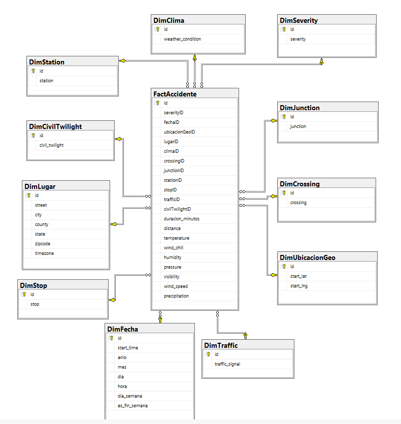

# BI_Datamart_Accidentes — Análisis de Accidentes de Tránsito en EE.UU.

**Integrantes:** Diego Saldaña, Diego Rodríguez, Sebastián Vinces y Mario Auqui

---

## 1. Marco Teórico

### 1.1 Business Intelligence

Business Intelligence (BI) es el conjunto de estrategias, procesos, tecnologías y herramientas orientadas a la recopilación, integración, análisis y presentación de información empresarial con el fin de apoyar la toma de decisiones. A diferencia de los sistemas transaccionales, cuyo objetivo es el registro eficiente de operaciones, los sistemas de BI están diseñados para consolidar grandes volúmenes de datos históricos y transformarlos en conocimiento accionable. En el contexto de seguridad vial, el BI permite convertir millones de registros de accidentes en patrones identificables, KPIs significativos y visualizaciones que faciliten la acción preventiva.

### 1.2 Data Warehouse y Datamart

Un Data Warehouse (DWH) es un repositorio centralizado que integra datos provenientes de múltiples fuentes operacionales, transformados y estructurados para el análisis. Su diseño privilegia la velocidad de consulta y la consistencia histórica sobre la eficiencia transaccional. Un datamart es un subconjunto temático de un Data Warehouse, orientado a un área funcional específica —en este caso, la accidentalidad vial— que permite obtener respuestas rápidas a preguntas de negocio concretas. El presente proyecto implementa un datamart independiente sobre el dataset US-Accidents, habilitando consultas multidimensionales sobre severidad, clima, geografía y tiempo.

### 1.3 Modelamiento Dimensional

El modelamiento dimensional es la técnica de diseño de bases de datos analíticas propuesta por Ralph Kimball, cuyo objetivo es estructurar los datos de manera que sean intuitivos para el análisis y eficientes para la consulta. Se basa en dos tipos de tablas fundamentales:

- **Tabla de hechos (Fact Table):** almacena las métricas cuantitativas del proceso de negocio —en este caso, FactAccidente— junto con las claves foráneas que apuntan a las dimensiones. Las medidas incluyen duración del accidente, distancia del tramo afectado, temperatura, humedad, visibilidad y precipitación.

- **Tablas de dimensiones (Dimension Tables):** describen el contexto de cada hecho. En este proyecto se modelaron doce dimensiones: DimSeverity, DimFecha, DimUbicacionGeo, DimLugar, DimClima, DimCrossing, DimJunction, DimStation, DimStop, DimTraffic y DimCivilTwilight.

### 1.4 Esquema Estrella

El esquema estrella (star schema) es la implementación más común del modelamiento dimensional. Se caracteriza por una tabla de hechos central conectada directamente a múltiples tablas de dimensión sin normalización adicional. Esta estructura permite que los motores de consulta como SQL Server o herramientas de BI como Power BI ejecuten operaciones de agregación y filtrado de manera altamente eficiente, dado que las uniones (joins) se realizan siempre entre la tabla de hechos y una sola dimensión a la vez, evitando consultas complejas con múltiples niveles de relación.

En el presente proyecto, la tabla FactAccidente actúa como el centro del esquema, conectándose a once dimensiones que permiten analizar cada accidente desde perspectivas temporales, geográficas, climáticas e infraestructurales.

### 1.5 Proceso ETL (Extract, Transform, Load)

El proceso ETL comprende las etapas de extracción de datos desde las fuentes originales, transformación para limpiar, estandarizar e integrar la información, y carga en el modelo dimensional destino. En este proyecto, el dataset US-Accidents provee los datos crudos que deben ser procesados para derivar campos calculados como `duracion_minutos`, separar atributos en sus dimensiones correspondientes, y garantizar la integridad referencial entre la tabla de hechos y las dimensiones.

### 1.6 KPIs y Análisis Multidimensional

Los Indicadores Clave de Rendimiento (KPIs) son métricas que permiten evaluar el desempeño de un proceso respecto a objetivos definidos. En el contexto de seguridad vial, los KPIs propuestos —tasa de severidad alta, duración promedio del accidente, densidad geográfica de incidentes e índice de infraestructura crítica— permiten monitorear el comportamiento de la accidentalidad y orientar decisiones preventivas.

El análisis multidimensional (OLAP) permite navegar estos indicadores con distintos niveles de granularidad, aplicando operaciones como drill-down (desagregar, por ejemplo, de estado a ciudad), roll-up (agregar de hora a franja del día) y slice and dice (filtrar por condición climática o tipo de infraestructura). Esta capacidad analítica es la que distingue a un datamart de una base de datos operacional simple.

### 1.7 Dashboards e Inteligencia Operacional

Los dashboards interactivos son la capa de presentación del sistema de BI, permitiendo a los usuarios explorar los datos sin necesidad de conocimientos técnicos avanzados. En proyectos de seguridad vial, los dashboards facilitan la identificación visual de zonas de alto riesgo, patrones horarios y correlaciones entre condiciones ambientales y severidad de accidentes, traduciendo el análisis técnico en información directamente utilizable para la toma de decisiones estratégicas.

---

## 2. Descripción de la Fuente de Datos

El presente proyecto utiliza el dataset público US-Accidents, desarrollado por investigadores de The Ohio State University con el objetivo de recopilar y analizar información relacionada con accidentes de tránsito ocurridos en Estados Unidos. El dataset fue presentado originalmente en 2019 y surgió debido a la necesidad de contar con información masiva y enriquecida que permitiera estudiar patrones espaciales, temporales y ambientales asociados a la ocurrencia de accidentes de tránsito (Moosavi et al., 2019).

Los accidentes de tránsito representan una problemática importante debido a su impacto en la seguridad vial, la movilidad urbana y los costos económicos derivados de congestión vehicular, daños materiales y emergencias. Además, la gran cantidad de accidentes registrados diariamente dificulta la identificación de patrones relevantes y factores asociados a su ocurrencia, especialmente cuando intervienen múltiples variables como clima, ubicación geográfica, visibilidad, horario y características de la infraestructura vial.

El dataset US-Accidents fue construido mediante la integración de múltiples fuentes de información en tiempo real. La principal fuente utilizada para la recolección de accidentes fueron las APIs de MapQuest Traffic y Microsoft Bing Traffic, las cuales obtenían eventos reportados por sensores viales, cámaras de tránsito, departamentos de transporte y agencias de seguridad vial (Moosavi et al., 2019). Posteriormente, los registros fueron sometidos a procesos de integración y depuración para eliminar duplicados mediante comparaciones espaciales y temporales. La versión inicial del dataset descrita en el paper contenía aproximadamente 2.25 millones de registros de accidentes ocurridos entre febrero de 2016 y marzo de 2019 (Moosavi et al., 2019). Sin embargo, la versión actualmente disponible en Kaggle corresponde a una actualización posterior del dataset, ampliando la cobertura temporal hasta marzo de 2023 y alcanzando aproximadamente 7.7 millones de registros de accidentes (Moosavi, 2023).

Con el objetivo de enriquecer la información, los autores incorporaron datos meteorológicos obtenidos mediante la API de Weather Underground, incluyendo variables como temperatura, humedad, presión atmosférica, velocidad del viento, precipitación, lluvia, nieve, niebla y visibilidad. Asimismo, utilizaron herramientas geoespaciales como OpenStreetMap (OSM) y Nominatim Reverse Geocoding para complementar la información geográfica de cada accidente, permitiendo identificar calles, ciudades, intersecciones, junctions, señales de tránsito y distintos puntos de interés cercanos a cada incidente (Moosavi et al., 2019).

Adicionalmente, se incorporó información temporal mediante la API de TimeAndDate, permitiendo clasificar los accidentes según periodos del día y condiciones de iluminación, como sunrise/sunset y distintos niveles de twilight (Moosavi et al., 2019). Gracias a este proceso de enriquecimiento, el dataset permite analizar los accidentes desde distintas perspectivas y facilita la identificación de tendencias relacionadas con factores climáticos, temporales y geográficos.

---

## 3. Problemática

Los accidentes de tránsito representan una problemática importante por su impacto en la seguridad vial, la movilidad urbana y los costos económicos derivados de congestión vehicular, daños materiales y emergencias.

La gran cantidad de datos generados diariamente dificulta convertir dicha información en conocimiento útil para la toma de decisiones estratégicas. Aunque existen millones de registros disponibles, muchas organizaciones presentan limitaciones para:

- Analizar patrones de accidentes de manera eficiente.
- Identificar zonas de alto riesgo.
- Generar reportes estratégicos para prevención de accidentes.
- Relacionar variables como clima, horario, ubicación y severidad del accidente.

> La información suele encontrarse **dispersa y poco estructurada** para procesos analíticos avanzados, dificultando la implementación de estrategias preventivas y la optimización de recursos destinados a seguridad vial.

---

## 4. Solución Propuesta

El presente proyecto propone el desarrollo de una solución de **Business Intelligence** que permita consolidar y analizar la información mediante:

- Modelos dimensionales (esquema estrella)
- Dashboards interactivos

Con ello se busca mejorar la capacidad de análisis de accidentes de tránsito y facilitar la **toma de decisiones basada en datos**.

### 4.1 Objetivo del Proyecto

Construir un datamart que habilite consultas rápidas, agregaciones multidimensionales y la generación de KPIs relevantes para la gestión de la seguridad vial, facilitando la identificación de patrones de accidentalidad y la toma de decisiones preventivas basadas en datos.

### 4.2 Preguntas de Negocio y Decisiones Esperadas

- ¿En qué horarios y días de la semana ocurren más accidentes de alta severidad?
- ¿Qué estados y ciudades concentran la mayor cantidad de accidentes graves?
- ¿Qué condiciones climáticas están más asociadas a accidentes de severidad 3 y 4?
- ¿Qué tipo de infraestructura vial (cruces, semáforos, intersecciones) está más presente en accidentes graves?
- ¿Cuál es la duración promedio de los accidentes según severidad, clima y zona geográfica?

### 4.3 KPIs Propuestos para el Datamart

- **Tasa de severidad alta:** proporción de accidentes con severidad 3 o 4 sobre el total de registros.
- **Duración promedio del accidente:** media de `duracion_minutos` por dimensión (severidad, clima, lugar, franja horaria).
- **Accidentes por zona geográfica:** conteo y densidad de accidentes agrupados por estado, ciudad y condado.
- **Accidentalidad por condición climática:** distribución de accidentes y severidad promedio según `Weather_Condition`.
- **Índice de infraestructura crítica:** proporción de accidentes graves ocurridos cerca de cruces, semáforos o intersecciones.
- **Accidentes por franja horaria:** distribución de accidentes según hora del día, día de la semana y condición de luz (DimCivilTwilight).

Estos KPIs se calcularán sobre la tabla de hechos `FactAccidente` con dimensiones conformadas (fecha, lugar, clima, severidad) para permitir cortes consistentes y comparables.

---

## 5. Modelamiento de Data Dimensional

---

## 6. Diccionario de Datos

### 6.1 FactAccidente

| Columna | Tipo | Descripción |
|---|---|---|
| id | INT (PK) | Identificador interno del registro en la tabla de hechos. |
| severityID | INT (FK) | Llave foránea hacia DimSeverity. |
| fechaID | INT (FK) | Llave foránea hacia DimFecha. |
| ubicacionGeoID | INT (FK) | Llave foránea hacia DimUbicacionGeo. |
| lugarID | INT (FK) | Llave foránea hacia DimLugar. |
| climaID | INT (FK) | Llave foránea hacia DimClima. |
| crossingID | INT (FK) | Llave foránea hacia DimCrossing. |
| junctionID | INT (FK) | Llave foránea hacia DimJunction. |
| stationID | INT (FK) | Llave foránea hacia DimStation. |
| stopID | INT (FK) | Llave foránea hacia DimStop. |
| trafficID | INT (FK) | Llave foránea hacia DimTraffic. |
| civilTwilightID | INT (FK) | Llave foránea hacia DimCivilTwilight. |
| duracion_minutos | FLOAT | Duración del accidente en minutos, calculada como diferencia entre `End_Time` y `Start_Time`. |
| distance | FLOAT | Longitud del tramo vial afectado por el accidente, en millas (`Distance(mi)`). |
| temperature | FLOAT | Temperatura ambiente al momento del accidente, en grados Fahrenheit (`Temperature(F)`). |
| wind_chill | FLOAT | Sensación térmica por viento al momento del accidente, en grados Fahrenheit (`Wind_Chill(F)`). |
| humidity | FLOAT | Porcentaje de humedad relativa al momento del accidente (`Humidity(%)`). |
| pressure | FLOAT | Presión atmosférica al momento del accidente, en pulgadas de mercurio (`Pressure(in)`). |
| visibility | FLOAT | Visibilidad en millas al momento del accidente (`Visibility(mi)`). |
| wind_speed | FLOAT | Velocidad del viento al momento del accidente, en millas por hora (`Wind_Speed(mph)`). |
| precipitation | FLOAT | Nivel de precipitación al momento del accidente, en pulgadas (`Precipitation(in)`). |

### 6.2 DimSeverity

| Columna | Tipo | Descripción |
|---|---|---|
| id | INT (PK) | Identificador de severidad. |
| severity | INT | Nivel de impacto del accidente sobre el tráfico circundante. Escala del 1 al 4, donde 1 es el menor impacto y 4 el mayor (`Severity`). |

### 6.3 DimFecha

| Columna | Tipo | Descripción |
|---|---|---|
| id | INT (PK) | Identificador de la fecha. |
| start_time | DATETIME | Fecha y hora de inicio del accidente en zona horaria local (`Start_Time`). |
| anio | INT | Año de ocurrencia del accidente. |
| mes | INT | Mes de ocurrencia del accidente (1–12). |
| dia | INT | Día del mes de ocurrencia del accidente (1–31). |
| hora | INT | Hora de inicio del accidente (0–23). |
| dia_semana | INT | Día de la semana (1 = lunes, 7 = domingo). |
| es_fin_semana | BIT | Indicador de fin de semana (1 = sábado o domingo, 0 = día hábil). |

### 6.4 DimUbicacionGeo

| Columna | Tipo | Descripción |
|---|---|---|
| id | INT (PK) | Identificador de ubicación geográfica. |
| start_lat | FLOAT | Latitud del punto GPS donde inició el accidente (`Start_Lat`). |
| start_lng | FLOAT | Longitud del punto GPS donde inició el accidente (`Start_Lng`). |

### 6.5 DimLugar

| Columna | Tipo | Descripción |
|---|---|---|
| id | INT (PK) | Identificador del lugar. |
| street | NVARCHAR(200) | Nombre de la calle donde ocurrió el accidente (`Street`). |
| city | NVARCHAR(100) | Nombre de la ciudad donde ocurrió el accidente (`City`). |
| county | NVARCHAR(100) | Nombre del condado donde ocurrió el accidente (`County`). |
| state | NVARCHAR(10) | Código del estado donde ocurrió el accidente (`State`). |
| zipcode | NVARCHAR(20) | Código postal de la zona del accidente (`Zipcode`). |
| timezone | NVARCHAR(50) | Zona horaria donde ocurrió el accidente (`Timezone`). |

### 6.6 DimClima

| Columna | Tipo | Descripción |
|---|---|---|
| id | INT (PK) | Identificador de condición climática. |
| weather_condition | NVARCHAR(100) | Descripción de las condiciones meteorológicas al momento del accidente (ej. Clear, Rain, Snow, Fog) (`Weather_Condition`). |

### 6.7 DimCrossing

| Columna | Tipo | Descripción |
|---|---|---|
| id | INT (PK) | Identificador de cruce peatonal. |
| crossing | BIT | Indica si el accidente ocurrió cerca de un cruce peatonal (True/False) (`Crossing`). |

### 6.8 DimJunction

| Columna | Tipo | Descripción |
|---|---|---|
| id | INT (PK) | Identificador de intersección vial. |
| junction | BIT | Indica si el accidente ocurrió cerca de una intersección vial (True/False) (`Junction`). |

### 6.9 DimStation

| Columna | Tipo | Descripción |
|---|---|---|
| id | INT (PK) | Identificador de estación. |
| station | BIT | Indica si el accidente ocurrió cerca de una estación de transporte público (True/False) (`Station`). |

### 6.10 DimStop

| Columna | Tipo | Descripción |
|---|---|---|
| id | INT (PK) | Identificador de parada. |
| stop | BIT | Indica si el accidente ocurrió cerca de una señal de stop o parada de tránsito (True/False) (`Stop`). |

### 6.11 DimTraffic

| Columna | Tipo | Descripción |
|---|---|---|
| id | INT (PK) | Identificador de señal de tráfico. |
| traffic_signal | BIT | Indica si el accidente ocurrió cerca de un semáforo (True/False) (`Traffic_Signal`). |

### 6.12 DimCivilTwilight

| Columna | Tipo | Descripción |
|---|---|---|
| id | INT (PK) | Identificador de condición de luz civil. |
| civil_twilight | NVARCHAR(10) | Indica si el accidente ocurrió durante el día o la noche según el crepúsculo civil (Day/Night) (`Civil_Twilight`). |

---

## 7. Referencias

Moosavi, S., Samavatian, M. H., Parthasarathy, S., & Ramnath, R. (2019). A countrywide traffic accident dataset. arXiv. https://arxiv.org/abs/1906.05409

Moosavi, S., Samavatian, M. H., Parthasarathy, S., & Ramnath, R. (2023). US-Accidents: A countrywide traffic accident dataset (2016–2023) [Dataset]. Kaggle. https://www.kaggle.com/datasets/sobhanmoosavi/us-accidents